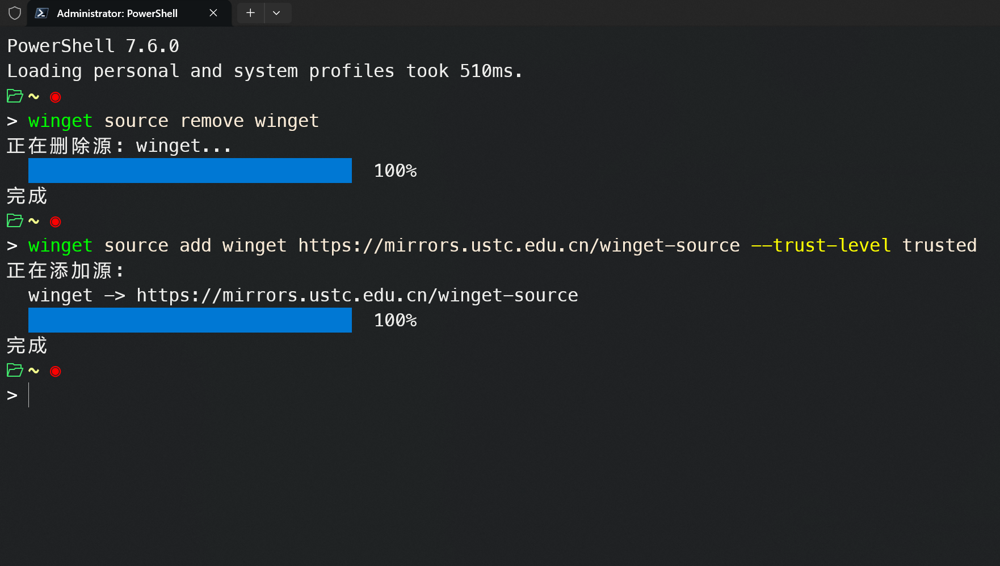
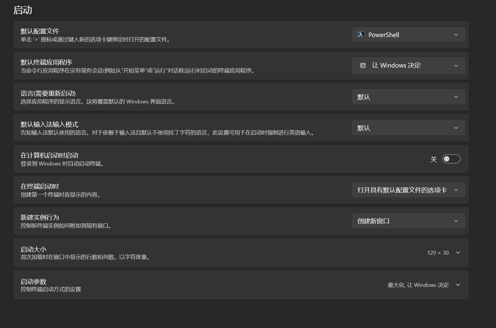
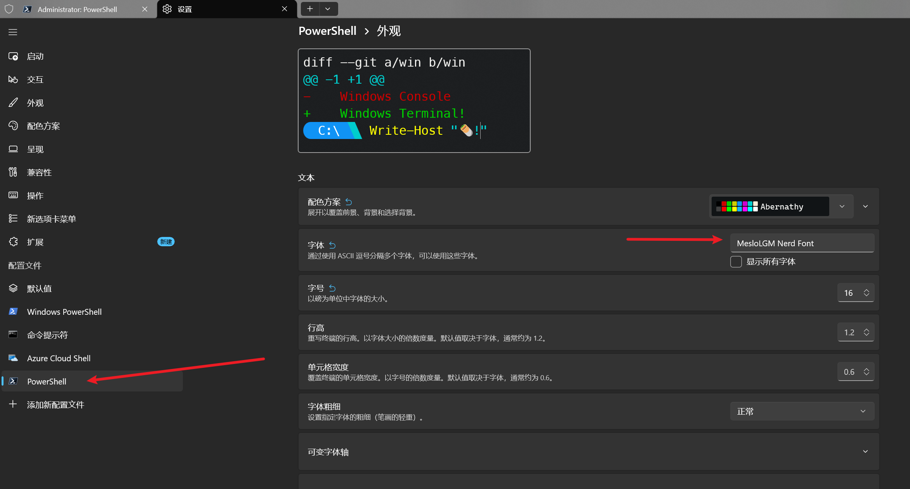
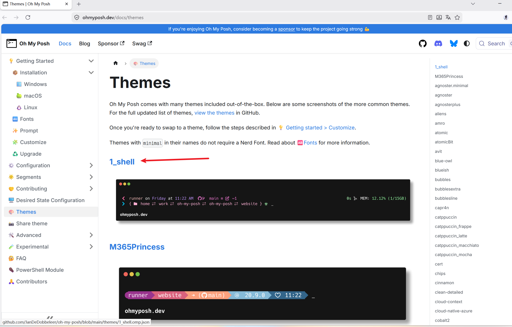
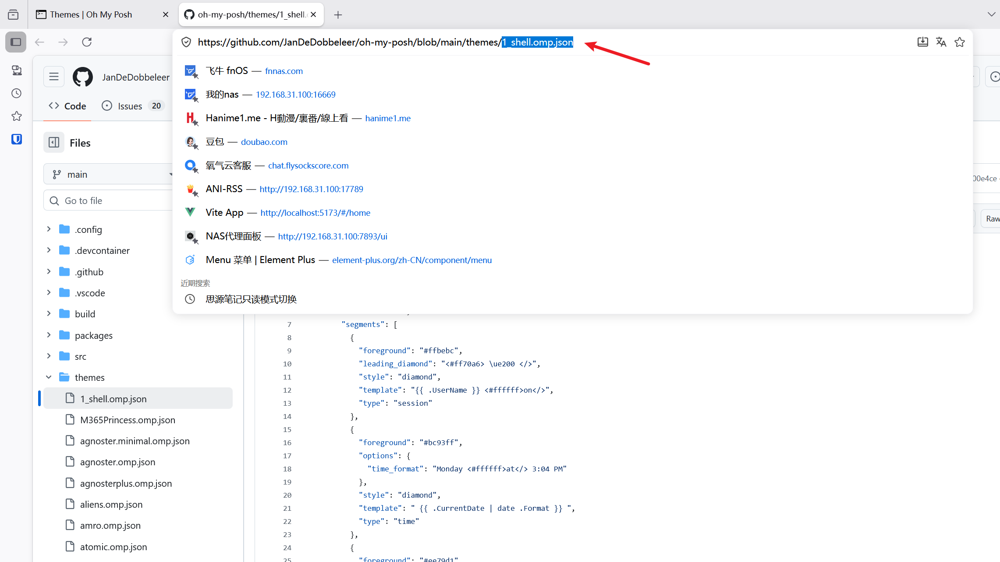
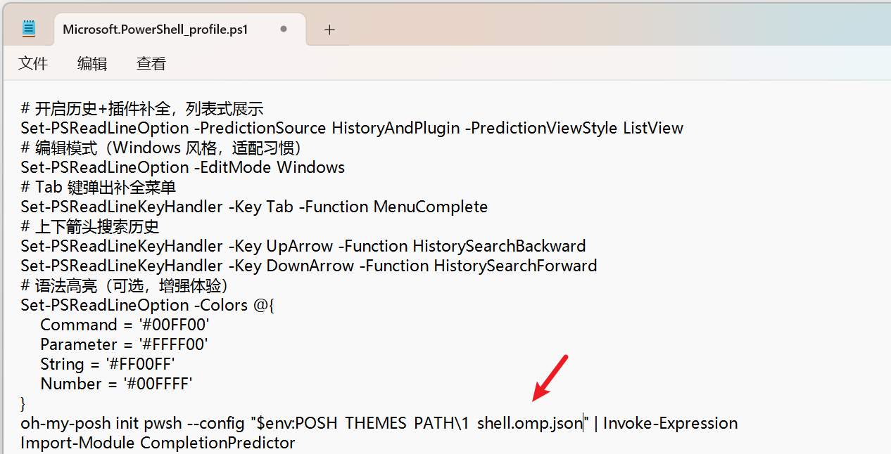

## 相关软件安装

用 windows 终端查看 winget 版本(用 powershell)

需大于 1.28

```powershell
winget -v
```

更新 winget

```powershell
winget upgrade Microsoft.AppInstaller
```

更换国内源

需使用管理员权限

```powershell
winget source remove 
winget winget source add winget https://mirrors.ustc.edu.cn/winget-source --trust-level trusted

```



安装 powershell 最新版

```powershell
winget install --id Microsoft.PowerShell
```

更新终端

```powershell
winget upgrade Microsoft.WindowsTerminal
```

更新后重启终端并设置新的 powershell 为默认



## Oh My Posh

安装 Oh My Posh

```powershell
winget install JanDeDobbeleer.OhMyPosh --source winget
```

配置 Oh My Posh(确保在 windows terminal 中使用最新版本的 powershell)

安装推荐字体（非常建议）

​`oh-my-posh font install meslo`

设置字体



安装 CompletionPredictor 插件(补全第三方工具比如 git、docker)

```powershell
Install-Module -Name CompletionPredictor -Scope CurrentUser -Force
```

创建配置文件

```powershell
if (!(Test-Path $PROFILE)) { New-Item -ItemType File -Path $PROFILE -Force }
```

用记事本打开配置文件

```powershell
notepad $PROFILE
```

输入内容

```txt
# 开启历史+插件补全，列表式展示
Set-PSReadLineOption -PredictionSource HistoryAndPlugin -PredictionViewStyle ListView
# 编辑模式（Windows 风格，适配习惯）
Set-PSReadLineOption -EditMode Windows
# Tab 键弹出补全菜单
Set-PSReadLineKeyHandler -Key Tab -Function MenuComplete
# 上下箭头搜索历史
Set-PSReadLineKeyHandler -Key UpArrow -Function HistorySearchBackward
Set-PSReadLineKeyHandler -Key DownArrow -Function HistorySearchForward
# 语法高亮（可选，增强体验）
Set-PSReadLineOption -Colors @{
    Command = '#00FF00'
    Parameter = '#FFFF00'
    String = '#FF00FF'
    Number = '#00FFFF'
}
oh-my-posh init pwsh --config "$env:POSH_THEMES_PATH\jandedobbeleer.omp.json" | Invoke-Expression
#主题更换:jandedobbeleer.omp.json这个就是主题文件，自行修改即可
Import-Module CompletionPredictor
```

修改主题

主题文件参考 [On My Posh 主题介绍](https://ohmyposh.dev/docs/themes)



复制这个选择的文字，替换掉上面配置文件的主题文件即可





重启终端
